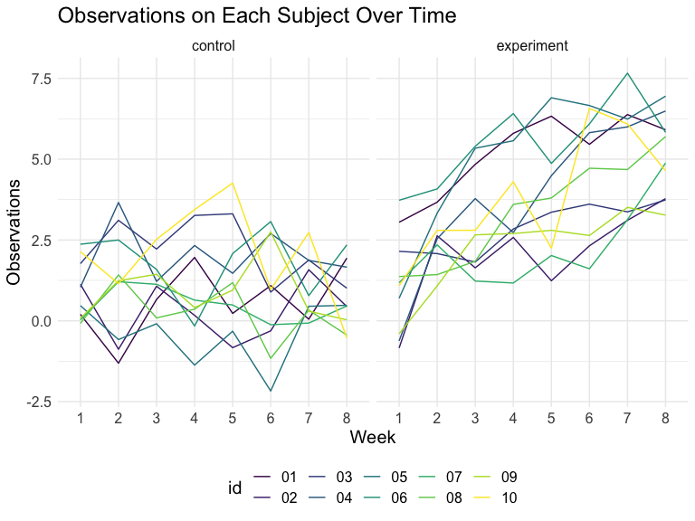
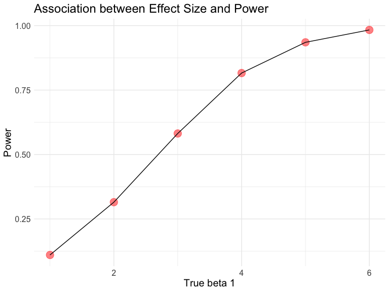
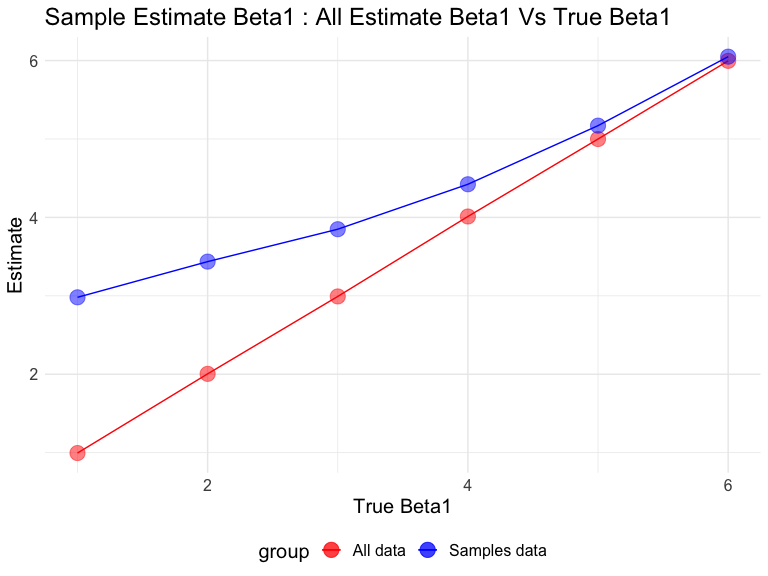

p8105\_hw5\_wx2233
================
Weijia Xiong
10/31/2019

## Problem 1

``` r
iris_with_missing = iris %>% 
  map_df(~replace(.x, sample(1:150, 20), NA)) %>%
  mutate(Species = as.character(Species))
```

``` r
## fill function
my_fill = function(x) {
  if (is.numeric(x)) {
     x = replace_na(x,round(mean(x,na.rm = TRUE),1))  #digit = 1 as same as the data
  }
  else if (is.character(x)) {
     x = replace_na(x,"virginica")
  }
  x
}

## apply using map
map(iris_with_missing, my_fill) %>% 
bind_cols()
```

    ## # A tibble: 150 x 5
    ##    Sepal.Length Sepal.Width Petal.Length Petal.Width Species  
    ##           <dbl>       <dbl>        <dbl>       <dbl> <chr>    
    ##  1          5.1         3.5          1.4         0.2 virginica
    ##  2          4.9         3            1.4         0.2 setosa   
    ##  3          4.7         3.2          1.3         0.2 setosa   
    ##  4          4.6         3.1          1.5         0.2 setosa   
    ##  5          5           3.6          1.4         0.2 setosa   
    ##  6          5.4         3.9          1.7         0.4 setosa   
    ##  7          5.8         3.4          1.4         0.3 setosa   
    ##  8          5           3.4          1.5         0.2 setosa   
    ##  9          4.4         2.9          1.4         0.2 setosa   
    ## 10          4.9         3.1          1.5         0.1 setosa   
    ## # … with 140 more rows

## Problem 2

### Create a tidy dataframe

``` r
file_list = list.files("./data")

read_data = function(x) {
  path = str_c("./data/",x)
  read_csv(path) %>% 
    janitor::clean_names()
}

new_data = 
  purrr::map(file_list,read_data) %>% 
  bind_rows() %>% 
  mutate(file_names = file_list) %>% 
  separate(file_names, into = c("group", "id"), sep = "_") %>% 
  mutate(
     id = str_remove(id,".csv"),
     group = recode(group,
                    "con" = "control",
                    "exp" = "experiment")
  ) %>% 
  select(id,group,everything())

new_data %>% 
  knitr::kable()
```

| id | group      | week\_1 | week\_2 | week\_3 | week\_4 | week\_5 | week\_6 | week\_7 | week\_8 |
| :- | :--------- | ------: | ------: | ------: | ------: | ------: | ------: | ------: | ------: |
| 01 | control    |    0.20 |  \-1.31 |    0.66 |    1.96 |    0.23 |    1.09 |    0.05 |    1.94 |
| 02 | control    |    1.13 |  \-0.88 |    1.07 |    0.17 |  \-0.83 |  \-0.31 |    1.58 |    0.44 |
| 03 | control    |    1.77 |    3.11 |    2.22 |    3.26 |    3.31 |    0.89 |    1.88 |    1.01 |
| 04 | control    |    1.04 |    3.66 |    1.22 |    2.33 |    1.47 |    2.70 |    1.87 |    1.66 |
| 05 | control    |    0.47 |  \-0.58 |  \-0.09 |  \-1.37 |  \-0.32 |  \-2.17 |    0.45 |    0.48 |
| 06 | control    |    2.37 |    2.50 |    1.59 |  \-0.16 |    2.08 |    3.07 |    0.78 |    2.35 |
| 07 | control    |    0.03 |    1.21 |    1.13 |    0.64 |    0.49 |  \-0.12 |  \-0.07 |    0.46 |
| 08 | control    |  \-0.08 |    1.42 |    0.09 |    0.36 |    1.18 |  \-1.16 |    0.33 |  \-0.44 |
| 09 | control    |    0.08 |    1.24 |    1.44 |    0.41 |    0.95 |    2.75 |    0.30 |    0.03 |
| 10 | control    |    2.14 |    1.15 |    2.52 |    3.44 |    4.26 |    0.97 |    2.73 |  \-0.53 |
| 01 | experiment |    3.05 |    3.67 |    4.84 |    5.80 |    6.33 |    5.46 |    6.38 |    5.91 |
| 02 | experiment |  \-0.84 |    2.63 |    1.64 |    2.58 |    1.24 |    2.32 |    3.11 |    3.78 |
| 03 | experiment |    2.15 |    2.08 |    1.82 |    2.84 |    3.36 |    3.61 |    3.37 |    3.74 |
| 04 | experiment |  \-0.62 |    2.54 |    3.78 |    2.73 |    4.49 |    5.82 |    6.00 |    6.49 |
| 05 | experiment |    0.70 |    3.33 |    5.34 |    5.57 |    6.90 |    6.66 |    6.24 |    6.95 |
| 06 | experiment |    3.73 |    4.08 |    5.40 |    6.41 |    4.87 |    6.09 |    7.66 |    5.83 |
| 07 | experiment |    1.18 |    2.35 |    1.23 |    1.17 |    2.02 |    1.61 |    3.13 |    4.88 |
| 08 | experiment |    1.37 |    1.43 |    1.84 |    3.60 |    3.80 |    4.72 |    4.68 |    5.70 |
| 09 | experiment |  \-0.40 |    1.08 |    2.66 |    2.70 |    2.80 |    2.64 |    3.51 |    3.27 |
| 10 | experiment |    1.09 |    2.80 |    2.80 |    4.30 |    2.25 |    6.57 |    6.09 |    4.64 |

### Plot

``` r
new_data %>% 
  pivot_longer(
    week_1:week_8,
    names_to = "week", 
    names_prefix = "week_",
    values_to = "observations"
    ) %>% 
ggplot(aes(x = week, y = observations)) +
  geom_line(aes(group = id,color = id)) +
  facet_grid(.~group) +
  labs(
    y = "Observations",
    x = "Week",
    title = "Observations on Each Subject Over Time"
  )
```



The experiment group’s observations have a increasing trend with time
while the control group’s observations are flutuating. Also, the
experiment group’s observations are more than the observations of
control group.

## Problem 3

### Regression function

``` r
set.seed(1)
sim_regression = function(beta1 = 0) {
  
  sim_data = tibble(
    x = rnorm(30, mean = 0, sd = 1),
    y = 2 + beta1 * x + rnorm(30, 0, sqrt(50))
  )
  
  ls_fit = 
    lm(y ~ x, data = sim_data) %>% 
    broom::tidy()
  
  tibble(
    beta1_hat = pull(ls_fit,estimate)[2],
    p_value = pull(ls_fit,p.value)[2]
  )
  
}
```

### Simulation

beta1 = 0

``` r
sim_results = 
  rerun(10000, sim_regression(0)) %>%  ## rerun
  bind_rows()
```

beta1 = {1,2,3,4,5,6}

``` r
sim_results_all = 
  tibble(beta_1 = c(1, 2, 3, 4, 5, 6)) %>% 
  mutate(
    output_list = 
      map(.x = beta_1, 
          ~bind_rows(rerun(10000,sim_regression(beta1 = .x)))
          )
    ) %>% 
  unnest(output_list)
```

### Power and True Beta 1

``` r
power_data = 
sim_results_all %>% 
  filter(p_value < 0.05) %>% 
  group_by(beta_1) %>% 
  summarize(
    power = n()/10000
  )

power_data %>% 
  ggplot(aes(x = beta_1, y = power)) +
  geom_point(color = "red ", size = 5, alpha = 0.5) +
  geom_line() +
    labs(
    y = "Power",
    x = "True beta 1",
    title = "Association between Effect Size and Power"
  )
```



The power of the test: proportion of times the null was rejected. Effect
size: true beta1 - 0 = true beta1 Association: the power increases with
the increasing of effect size.

### Plot of Estimate and True beta1

``` r
all_data = 
sim_results_all %>% 
  group_by(beta_1) %>% 
  summarize(
    avg_beta_hat_all = mean(beta1_hat)
  ) 
 
samples_data = 
sim_results_all %>% 
  filter(p_value < 0.05) %>% 
  group_by(beta_1) %>% 
  summarize(
    avg_beta_hat_sample = mean(beta1_hat)
  ) 

beta_data = left_join(all_data,samples_data)
```

    ## Joining, by = "beta_1"

``` r
beta_data %>% 
  ggplot(aes(x = beta_1)) +
  geom_point(aes(y = avg_beta_hat_all, color = "red"), size = 5, alpha = 0.5) +
  geom_line(aes(y = avg_beta_hat_all, color = "red")) +
  geom_point(aes(y = avg_beta_hat_sample,color = "blue"), size = 5, alpha = 0.5) +
  geom_line(aes(y = avg_beta_hat_sample,color = "blue")) +
  scale_color_identity(name = "group",
                       breaks = c("red", "blue"),
                       labels = c("All data", "Samples data"),
                       guide = "legend") +
  labs(
    title = "Sample Estimate Beta1 : All Estimate Beta1 Vs True Beta1",
    x = "True Beta1",
    y = "Estimate"
  ) 
```



The sample average of estimate beta1 across tests for which the null is
rejected is not equal the true value of beta1 when the effect size(true
beta1) is small. But with the increasing of effect size, it gets closer
to the true beta1.

This is because on the one hand, when effect size is small, the power is
low. And if we want to reject the hypothesis, the estimate beta need to
be much more extreme and far from the null. Therefore, when effect size
is small, the sample average of estimate beta1 is larger than estimate
beta1 of all data.

On the other hand, with the increase of effect size, the power also
increases(figure 1 in problem 3). In this case, the estimate beta does
not need to be more extremed to be rejected. So the sample average
estimate beta1 is closed to estimate beta1 of all data and the true
beta1.
