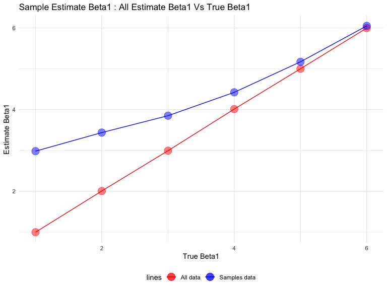

p8105\_hw5\_wx2233
================
Weijia Xiong
10/31/2019

## Problem 1

``` r
library(tidyverse)

set.seed(10)

iris_with_missing = iris %>% 
  map_df(~replace(.x, sample(1:150, 20), NA)) %>%
  mutate(Species = as.character(Species))
```

There are two cases to address:

For numeric variables, you should fill in missing values with the mean
of non-missing values For character variables, you should fill in
missing values with “virginica”

Write a function that takes a vector as an argument; replaces missing
values using the rules defined above; and returns the resulting vector.
Apply this function to the columns of iris\_with\_missing using a map
statement.

``` r
## fill function
my_fill = function(x) {
  if (is.numeric(x)) {
     x = replace_na(x,round(mean(x,na.rm = TRUE),1))
  }
  else if (is.character(x)) {
     x = replace_na(x,"virginica")
  }
  x
}

## apply using map
map(iris_with_missing, my_fill) %>% 
bind_cols()
```

    ## # A tibble: 150 x 5
    ##    Sepal.Length Sepal.Width Petal.Length Petal.Width Species
    ##           <dbl>       <dbl>        <dbl>       <dbl> <chr>  
    ##  1          5.1         3.5          1.4         0.2 setosa 
    ##  2          4.9         3            1.4         0.2 setosa 
    ##  3          4.7         3.2          1.3         0.2 setosa 
    ##  4          4.6         3.1          1.5         1.2 setosa 
    ##  5          5           3.6          1.4         0.2 setosa 
    ##  6          5.4         3.9          1.7         0.4 setosa 
    ##  7          5.8         3.4          1.4         0.3 setosa 
    ##  8          5           3.4          1.5         0.2 setosa 
    ##  9          4.4         2.9          1.4         0.2 setosa 
    ## 10          4.9         3.1          3.8         0.1 setosa 
    ## # … with 140 more rows

## Problem 2

This zip file contains data from a longitudinal study that included a
control arm and an experimental arm. Data for each participant is
included in a separate file, and file names include the subject ID and
arm.

Create a tidy dataframe containing data from all participants, including
the subject ID, arm, and observations over time:

Start with a dataframe containing all file names; the list.files
function will help Iterate over file names and read in data for each
subject using purrr::map and saving the result as a new variable in the
dataframe

Tidy the result; manipulate file names to include control arm and
subject ID, make sure weekly observations are “tidy”, and do any other
tidying that’s necessary

### Create a tidy dataframe

``` r
file_list = list.files("./data")

read_data = function(x) {
  path = str_c("./data/",x)
  read_csv(path) %>% 
    janitor::clean_names()
}

new_data = 
  purrr::map(file_list,read_data) %>% 
  bind_rows() %>% 
  mutate(file_names = file_list) %>% 
  separate(file_names, into = c("group", "id"), sep = "_") %>% 
  mutate(
     id = str_remove(id,".csv")
  ) %>% 
  select(id,group,everything())

new_data %>% 
  knitr::kable()
```

| id | group | week\_1 | week\_2 | week\_3 | week\_4 | week\_5 | week\_6 | week\_7 | week\_8 |
| :- | :---- | ------: | ------: | ------: | ------: | ------: | ------: | ------: | ------: |
| 01 | con   |    0.20 |  \-1.31 |    0.66 |    1.96 |    0.23 |    1.09 |    0.05 |    1.94 |
| 02 | con   |    1.13 |  \-0.88 |    1.07 |    0.17 |  \-0.83 |  \-0.31 |    1.58 |    0.44 |
| 03 | con   |    1.77 |    3.11 |    2.22 |    3.26 |    3.31 |    0.89 |    1.88 |    1.01 |
| 04 | con   |    1.04 |    3.66 |    1.22 |    2.33 |    1.47 |    2.70 |    1.87 |    1.66 |
| 05 | con   |    0.47 |  \-0.58 |  \-0.09 |  \-1.37 |  \-0.32 |  \-2.17 |    0.45 |    0.48 |
| 06 | con   |    2.37 |    2.50 |    1.59 |  \-0.16 |    2.08 |    3.07 |    0.78 |    2.35 |
| 07 | con   |    0.03 |    1.21 |    1.13 |    0.64 |    0.49 |  \-0.12 |  \-0.07 |    0.46 |
| 08 | con   |  \-0.08 |    1.42 |    0.09 |    0.36 |    1.18 |  \-1.16 |    0.33 |  \-0.44 |
| 09 | con   |    0.08 |    1.24 |    1.44 |    0.41 |    0.95 |    2.75 |    0.30 |    0.03 |
| 10 | con   |    2.14 |    1.15 |    2.52 |    3.44 |    4.26 |    0.97 |    2.73 |  \-0.53 |
| 01 | exp   |    3.05 |    3.67 |    4.84 |    5.80 |    6.33 |    5.46 |    6.38 |    5.91 |
| 02 | exp   |  \-0.84 |    2.63 |    1.64 |    2.58 |    1.24 |    2.32 |    3.11 |    3.78 |
| 03 | exp   |    2.15 |    2.08 |    1.82 |    2.84 |    3.36 |    3.61 |    3.37 |    3.74 |
| 04 | exp   |  \-0.62 |    2.54 |    3.78 |    2.73 |    4.49 |    5.82 |    6.00 |    6.49 |
| 05 | exp   |    0.70 |    3.33 |    5.34 |    5.57 |    6.90 |    6.66 |    6.24 |    6.95 |
| 06 | exp   |    3.73 |    4.08 |    5.40 |    6.41 |    4.87 |    6.09 |    7.66 |    5.83 |
| 07 | exp   |    1.18 |    2.35 |    1.23 |    1.17 |    2.02 |    1.61 |    3.13 |    4.88 |
| 08 | exp   |    1.37 |    1.43 |    1.84 |    3.60 |    3.80 |    4.72 |    4.68 |    5.70 |
| 09 | exp   |  \-0.40 |    1.08 |    2.66 |    2.70 |    2.80 |    2.64 |    3.51 |    3.27 |
| 10 | exp   |    1.09 |    2.80 |    2.80 |    4.30 |    2.25 |    6.57 |    6.09 |    4.64 |

### Plot

Make a spaghetti plot showing observations on each subject over time,
and comment on differences between groups.

``` r
new_data %>% 
  pivot_longer(
    week_1:week_8,
    names_to = "week", 
    names_prefix = "week_",
    values_to = "observations"
    ) %>% 
ggplot(aes(x = week, y = observations)) +
  geom_line(aes(group = id,color = id)) +
  facet_grid(.~group) +
  labs(
    y = "Observations",
    x = "Week",
    title = "Observations on Each Subject Over Time"
  )
```


The experiment group’s observations have a increasing trend with time
while the control group’s observations are flutuating. Also, the
experiment group’s observations are more than the observations of
control group.

## Problem 3

``` r
set.seed(1)
sim_regression = function(beta1 = 0) {
  
  sim_data = tibble(
    x = rnorm(30, mean = 0, sd = 1),
    y = 2 + beta1 * x + rnorm(30, 0, sqrt(50))
  )
  
  ls_fit = 
    lm(y ~ x, data = sim_data) %>% 
    broom::tidy()
  
  tibble(
    beta1_hat = pull(ls_fit,estimate)[2],
    p_value = pull(ls_fit,p.value)[2]
  )
  
}
```

## 

``` r
sim_results = 
  rerun(10000, sim_regression(0)) %>%  ## rerun
  bind_rows()
```

``` r
# sim_results_all = 
#   tibble(beta_1 = c(1, 2, 3, 4, 5, 6)) %>% 
#   mutate(
#     output_list = map(.x = beta_1, sim_regression)) %>% 
#   unnest


sim_results_all = 
  tibble(beta_1 = c(1, 2, 3, 4, 5, 6)) %>% 
  mutate(
    output_list = map(.x = beta_1, ~rerun(10000,sim_regression(beta1 = .x)))
    ) %>% 
  unnest %>% 
  unnest
```

### Power

Make a plot showing the proportion of times the null was rejected (the
power of the test) on the y axis and the true value of β2 on the x axis.
Describe the association between effect size and power.

``` r
power_data = 
sim_results_all %>% 
  filter(p_value < 0.05) %>% 
  group_by(beta_1) %>% 
  summarize(
    power = n()/10000
  )

power_data %>% 
  ggplot(aes(x = beta_1, y = power)) +
  geom_point(color = "red ", size = 5, alpha = 0.5) +
  geom_line()
```


Association: the power increases with the increasing of effect size.

### Plot of Estimate and True beta1

Make a plot showing the average estimate of β̂ 1 on the y axis and the
true value of β1 on the x axis. Make a second plot (or overlay on the
first) the average estimate of β̂ 1 only in samples for which the null
was rejected on the y axis and the true value of β1 on the x axis. Is
the sample average of β̂ 1 across tests for which the null is rejected
approximately equal to the true value of β1? Why or why not?

``` r
all_data = 
sim_results_all %>% 
  group_by(beta_1) %>% 
  summarize(
    avg_beta_hat_all = mean(beta1_hat)
  ) 
 
samples_data = 
sim_results_all %>% 
  filter(p_value < 0.05) %>% 
  group_by(beta_1) %>% 
  summarize(
    avg_beta_hat_sample = mean(beta1_hat)
  ) 

beta_data = left_join(all_data,samples_data)
```

    ## Joining, by = "beta_1"

``` r
beta_data %>% 
  ggplot(aes(x = beta_1)) +
  geom_point(aes(y = avg_beta_hat_all, color = "red"), size = 5, alpha = 0.5) +
  geom_line(aes(y = avg_beta_hat_all, color = "red")) +
  geom_point(aes(y = avg_beta_hat_sample,color = "blue"), size = 5, alpha = 0.5) +
  geom_line(aes(y = avg_beta_hat_sample,color = "blue")) +
  scale_color_identity(name = "lines",
                       breaks = c("red", "blue"),
                       labels = c("All data", "Samples data"),
                       guide = "legend") +
  labs(
    title = "Sample Estimate Beta1 : All Estimate Beta1 Vs True Beta1",
    x = "True Beta1",
    y = "Estimate Beta1"
  )
```


